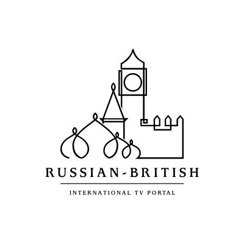
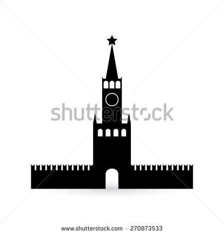

# Новый логотип Portico delle Parole

Требования:
  + Похож на предыдущий логотип
  + Быть проще
  + Узнаваем в малых масштабах (на печатях)
  + Узнаваем в монохромной гамме

Хороший контурный образец ([см. источник](http://www.thelogomix.com/designer/ancitis)):

Образец Спасской башни кремля:

Образец башен в Болонье:

Высота башни Азинелли - 97 м., Гаризенда - 48 м.
Высота Спасской башни кремля - 71 м., Никольской - 70 м.

